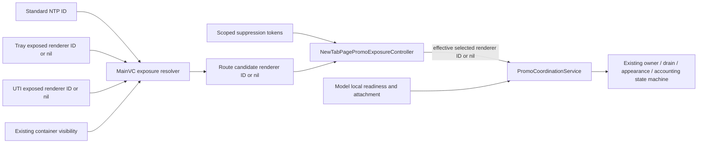

# iOS Promo Queue Exposure Refactor — Implementation Plan

## Status

- Planning document only.
- Target baseline: latest `bartosz/promo-q-3` cumulative implementation.
- Architecture size: medium, compatibility-first refactor.
- Do not push changes unless the user explicitly asks.
- Follow repository rules before editing or running tests. In particular, do not run tests, commit, or push without explicit user permission.

## Required reading

Read these documents completely before implementation:

```yaml
Read:
  - /Users/bkunat/Desktop/ddg-workspace/apple-browsers/promo-queue-docs/TECH_DESIGN_FINAL.md
  - /Users/bkunat/Desktop/ddg-workspace/apple-browsers/promo-queue-docs/ADDING_PROMOS.md
  - /Users/bkunat/Desktop/ddg-workspace/apple-browsers/promo-queue-docs/TECH_DESIGN_FINAL_APPENDIX.html
```

Also read the repository instructions applicable to Swift, iOS architecture, logging, testing, and any files being changed. At minimum, start with:

```yaml
Read:
  - /Users/bkunat/Desktop/ddg-workspace/apple-browsers3/AGENTS.md
  - /Users/bkunat/Desktop/ddg-workspace/apple-browsers3/.cursor/rules/general.mdc
  - /Users/bkunat/Desktop/ddg-workspace/apple-browsers3/.cursor/rules/anti-patterns.mdc
  - /Users/bkunat/Desktop/ddg-workspace/apple-browsers3/.cursor/rules/code-style.mdc
```

Before editing, verify the current branch, HEAD, worktree state, and whether the implementation has changed since this plan was written. Do not discard unrelated user changes. Line numbers below are orientation points, not immutable contracts.

## Problem to solve

The Promo Queue correctly coordinates known RMF cards and modal promos, but its UI-exposure contract is distributed across several owners:

- `setPromoSurfaceActive`
- `setPromoSurfaceRenderable`
- `setPromoSurfaceVisible`
- `setPromoSurfaceCovered`
- `NewTabPagePromoSurfaceHandoff`

The standard NTP, suggestion tray, unified input, alpha-transition paths, and Dax/onboarding overlays each push some part of the exposure state. A future NTP host or overlay can omit that integration and leave an attached renderer incorrectly eligible without an obvious failure.

This refactor must reduce that silent-integration hazard without rewriting the queue, navigation system, modal manager, RMF selection, accounting, cooldown policy, or physical-removal implementation.

### Important scope clarification

Adding a new RMF campaign to an existing card surface should not require UI-exposure integration today or after this refactor. The error-prone cases are:

1. adding a new physical NTP renderer/host;
2. adding a route that replaces or covers an NTP renderer;
3. adding an overlay or animation that hides an attached NTP;
4. changing tray or unified-input content switching.

The target design makes those cases fail closed or pass through a narrow infrastructure API. It does not move UI responsibilities into individual promo definitions.

## Decision summary

Keep the existing `PromoCoordinationService` ownership, draining, appearance, modal, cooldown, and accounting machinery. Add one UI-owned `NewTabPagePromoExposureController` that derives exactly one selected renderer ID and manages scoped occlusion blockers.

The service gains one additional admission condition:

```text
effective eligibility =
    registration is locally ready
    AND registration.rendererID == selectedRendererID
```

The UI controller outputs `nil` while the selected renderer is suppressed, unknown, contradictory, or transitioning.

The final UI model has three orthogonal facts:

1. **Selected renderer** — which physical NTP host is on the active route.
2. **Presented content** — whether tray/UTI is actually presenting its RMF-capable favorites NTP rather than autocomplete, Duck.ai, query results, logo, fire content, or another state.
3. **Occlusion** — whether a temporary overlay or visibility transition suppresses that renderer.

Attachment, view lifecycle readiness, foreground readiness, candidate availability, appearance confirmation, and exact removal remain separate existing safety signals.

## Explicit non-goals

Do not include any of the following in this refactor:

- Moving RMF admission or leasing into `HomePageConfiguration` or `remoteMessageToShow`.
- Using SwiftUI `onDisappear` as a release or physical-removal terminal.
- Rewriting `PromoQueueLeaseArbiter`.
- Rewriting `ModalPromptCoordinationManager` or changing exact modal-root lifetime.
- Changing candidate selection, RMF dismissal, RMF content construction, or `HomePageConfiguration` accounting.
- Changing cooldown directions, durations, session-history semantics, or ordinary RMF impression semantics.
- Pausing an owned RMF session indefinitely underneath a temporary blocker. Preserve the current drain/end/re-admission behavior unless product explicitly approves different lease semantics.
- Changing the feature-off/legacy rendering and eager-accounting behavior.
- Replacing `MainViewController` navigation with a clean-slate route or presentation stack.
- Detecting arbitrary pixel-level occlusion by any possible UIKit sibling. UIKit has no reliable semantic callback for that.
- Reducing the physical-removal guarantees to a timer, cooldown, source-null event, or incidental SwiftUI lifecycle callback.
- Adding new production telemetry/pixels unless separately approved.

## Invariants that must not regress

Treat these as hard acceptance criteria throughout every phase:

1. At most one logical promo owner exists.
2. At most one renderer is authorized to publish an RMF presentation.
3. Modal and RMF physical lifetimes never overlap.
4. Selection changes do not release an owned RMF immediately. The owner remains draining until the exact removal terminal and settlement complete.
5. iOS 17+ removal continues to use the exact native animation completion currently used by the model.
6. Older supported iOS versions continue to use synchronous, non-animated source removal and verification.
7. Verified host detachment remains an independent terminal.
8. Renderer registration generations continue rejecting stale callbacks and terminals.
9. An RMF appearance is accepted only for the exact session, presentation, renderer generation, selected renderer, local readiness, and live attachment.
10. Queue history and ordinary RMF `didAppear` accounting happen only after accepted appearance.
11. Renderer handoff preserves the logical session where the current implementation does so and does not create extra queue-history writes.
12. Directional cooldown behavior remains unchanged.
13. Foreground/full-interaction readiness remains required for new acquisition.
14. The feature-off path remains behaviorally unchanged and does not start using queue storage, arbitration, selection, or blockers.
15. Missing integration fails closed: suppress the promo and expose a diagnostic rather than guessing a renderer or allowing overlap.
16. A selected but non-RMF-capable alternate host must not fall through to the standard NTP underneath it.

## Current architecture to preserve

### Candidate and publication

- `HomePageConfiguration` selects and exposes an RMF candidate.
- Each `NewTabPageMessagesModel` snapshots candidate content.
- In coordinated mode, a model publishes an RMF only after the app-scoped service authorizes its exact renderer/presentation.

Relevant starting points:

- `iOS/DuckDuckGo/HomePageConfiguration.swift`
- `iOS/DuckDuckGo/NewTabPageMessagesModel.swift`
- `iOS/DuckDuckGo/AppServices/PromoCoordinationService.swift`

### Physical renderers

There are currently three production NTP render paths:

1. Standard NTP, created by `MainViewController`.
2. Suggestion-tray favorites NTP, owned/cached by `SuggestionTrayViewController`.
3. Unified-input favorites NTP, owned/cached by `UnifiedSuggestionsHost` through `UnifiedInputContentContainerViewController`.

Each `NewTabPageViewController` creates a distinct promo surface UUID. The configuration may be shared, but its identity is not the safety boundary.

### Physical removal

Preserve the complete current terminal protocol:

- service transitions the exact presentation to draining;
- renderer withdraws the exact render source;
- iOS 17+ reports the native `.removed` completion;
- older iOS reports verified synchronous source removal;
- host teardown can report independently verified window detachment;
- the service settles the terminal before releasing ownership or authorizing a successor.

Do not use the card's mount lifecycle as a substitute. The card can be structurally remounted, lazily evicted, alpha-hidden, or covered while its logical presentation remains active.

## Target architecture



### Responsibility boundaries

#### `NewTabPagePromoExposureController`

An injected, `@MainActor`, MainVC-scoped UI object. It owns:

- the current route candidate renderer ID;
- renderer-scoped and global blocker records;
- the deduplicated effective selected renderer ID;
- debug state explaining why selection is `nil` or blocked;
- a sink to `PromoCoordinationService.setSelectedRemoteMessageRendererID`.

It does **not** own:

- candidates;
- leases;
- logical sessions or physical presentations;
- modal lifetime;
- queue history or RMF accounting;
- cooldowns;
- physical-removal terminals.

Do not make it a singleton. Inject or retain it through the current MainVC dependency graph.

#### `PromoCoordinationService`

It remains the authority for logical ownership and physical presentation. Add only selected-renderer gating and related debug state.

Conceptually distinguish:

```swift
registration.isLocallyReady
registration.isEffectivelyEligible
```

Where effective eligibility is computed by the service and never pushed as a complete truth by a renderer.

Initially, during compatibility migration, use:

```text
effective eligibility =
    legacy exposure eligibility
    AND renderer ID matches selected renderer ID
```

Only simplify local readiness after every old host/visibility/coverage producer has been migrated and tested.

#### Host exposure providers

Suggestion tray and unified input retain one semantic responsibility: report whether their RMF-capable favorites renderer is the content physically presented by that host.

Prefer a read-only value plus change notification:

```swift
@MainActor
protocol NewTabPagePromoSurfaceProviding: AnyObject {
    var exposedPromoRendererID: UUID? { get }
    var onPromoSurfaceExposureChanged: (() -> Void)? { get set }
}
```

The exact API may be adapted to existing conventions. Preserve these semantics:

- Callbacks request a fresh pull/reconciliation from `MainViewController`.
- A child callback must not push an authoritative selected ID directly into the service.
- Delayed callbacks from a now-inactive host must therefore be harmless.
- `nil` means “this host is present but does not currently expose an RMF-capable NTP,” not “fall through to a lower host.”

### MainVC resolver

Derive the route candidate from the real current host containers, without creating a new navigation state machine:

```text
if unified-input container is currently the covering host:
    candidate = unifiedInput.exposedPromoRendererID // may be nil
else if suggestion-tray container is currently the covering host:
    candidate = suggestionTray.exposedPromoRendererID // may be nil
else if the standard NTP is installed in the content container:
    candidate = standardNTP.promoSurfaceID
else:
    candidate = nil
```

Implementation requirements:

- Confirm actual host precedence and transition timing in current code before encoding it.
- Never fall through to standard NTP merely because the active alternate host reports `nil`.
- If the current UI legitimately keeps two containers visible during a transition, model that interval explicitly as `nil` or retain the outgoing candidate until its established physical boundary. Do not authorize both.
- If two states are contradictory outside an expected transition, assert/log in debug and return `nil`.
- Container visibility changes should trigger reconciliation centrally. Prefer notifications from the existing MainView container subclasses or a similarly narrow observation point over calls scattered at every show/hide site.
- Standard NTP installation/removal must trigger reconciliation after attachment and before teardown respectively.
- Deduplicate repeated output of the same renderer ID.

### What replaces `setPromoSurfaceRenderable`

The public/general-purpose setter is removed in the final phase, but its underlying leaf fact is still required.

- Standard NTP: content is inherently the RMF-capable NTP while that host is selected; lifecycle/attachment remain separate gates.
- Suggestion tray: expose its embedded ID only after favorites physically replace autocomplete/Duck.ai and the existing transition completion fires. Publish `nil` immediately when favorites stop being the presented content, on hide, and on teardown.
- Unified input: expose its embedded ID only while its host is active, the resolver's current content is favorites, and the tab is not a fire state. Logo, list/query, inactive, and other content expose `nil`.

This converts an ambiguous “renderable” boolean into a semantic `exposedPromoRendererID` at the two owners that actually know that fact.

## Scoped suppression tokens

Replace explicit visibility-generation and coverage booleans with identity-scoped blocker records owned by `NewTabPagePromoExposureController`.

Illustrative API:

```swift
enum PromoSurfaceBlockerScope: Equatable {
    case renderer(UUID)
    case allRenderers
}

enum PromoSurfaceBlockerReason: Equatable {
    case daxOverlay
    case onboardingOverlay
    case standardNTPVisibilityTransition
    case hostTransition
    case other(String)
}

@MainActor
protocol PromoSurfaceBlocking {
    func blockPromoSurface(
        scope: PromoSurfaceBlockerScope,
        reason: PromoSurfaceBlockerReason,
        source: PromoSurfaceBlockerSource
    ) -> PromoSurfaceBlockerToken
}
```

Follow project style when choosing concrete names and source-location representation. The required behavior is:

1. Each token has a unique identity.
2. Tokens compose; any matching active blocker suppresses the route candidate.
3. `release()` is explicit and idempotent.
4. A stale completion releases only its own token.
5. Acquire before changing alpha, installing an overlay, or beginning a covering transition.
6. Release only after physical visibility is restored or the overlay is physically removed.
7. Do not automatically release a forgotten token in `deinit`; that would turn a retention bug into silent eligibility. Log/assert in debug and remain fail closed.
8. Renderer-scoped blockers are cleared safely when that exact renderer deregisters, with diagnostics for unreleased records.
9. A leaked global blocker remains fail closed and must be visible in debug output.
10. Use renderer scope unless an overlay truly covers every possible NTP host.

Avoid storing source files or other unnecessary user data in production persistence. Blocker diagnostics should remain ephemeral and suitable for existing debug surfaces/logging policy.

### Managed Dax/onboarding overlay session

Wrap the existing NTP-owned overlay installation/removal path so callers do not manipulate Promo Queue booleans or tokens individually.

The wrapper/session must:

- acquire the blocker before installing the first covering hosting controller;
- retain one continuous blocker across Dax/onboarding hosting-controller replacement;
- avoid an eligibility pulse while replacing outgoing content with incoming content;
- release only after the final covering controller has been physically removed;
- handle cancellation, repeated removal, teardown, and replacement idempotently;
- make blocking the default;
- require an explicit documented opt-out for overlay content proven not to occlude the promo surface.

This replaces the current `updatePromoSurfaceCoverage: false`-style exception plumbing rather than translating it into token calls at every existing site.

### Visibility/alpha transitions

For standard-NTP alpha or chat-path transitions:

- acquire a renderer blocker before setting alpha to zero or starting a transition that makes the surface non-visible;
- retain the token through the complete transition;
- release that exact token only after visibility is physically restored;
- cancellation/interruption must either restore visibility and release or leave a diagnosable blocker;
- overlapping transitions must own separate tokens, eliminating the current generation counter.

## Failure behavior

The refactor deliberately prefers promo suppression to collision or false accounting:

| Failure | Required outcome |
|---|---|
| No selected renderer | No coordinated RMF publication |
| Selected ID not registered yet | Remain ineligible until that exact registration exists |
| New renderer omitted from resolver | It cannot publish an RMF; emit debug evidence where possible |
| Active tray/UTI content is not favorites | Do not fall through to standard NTP |
| Contradictory host-container state | Assert/log in debug and select `nil` |
| Stale host callback | Fresh pull preserves the current route |
| Stale blocker completion | Only the stale token is released; newer blockers remain |
| Leaked blocker | RMF stays suppressed and blocker provenance is diagnosable |
| Missing exact removal terminal | Existing service remains draining and retains ownership |
| Stale appearance after deselection/block | Reject it; write no queue history or ordinary appearance accounting |

## Phased implementation

Each phase should leave the coordinated path internally consistent. Do not remove an old safety gate in the same step that first introduces its replacement unless the tests and wiring land atomically. Logical phases may become separate reviewable changes, but do not commit or push without explicit user permission.

**Activation-order requirement:** Phases 1 and 2 may be developed sequentially, but selected-ID enforcement and the production resolver must land atomically. A production service that requires a selected ID while nothing supplies one would suppress every coordinated RMF. If the work must be split into independently runnable changes, Phase 1 may add storage/API/tests without activating the new gate; activate `existing eligibility && selected-ID match` only after Phase 2 supplies the root resolver. Do not add a fallback that interprets `nil` as “choose the first eligible renderer.”

### Phase 0 — Baseline, inventory, and characterization

Objective: establish the exact current behavior and enumerate every producer before changing eligibility.

Tasks:

1. Record the current branch/HEAD and cumulative diff baseline.
2. Re-run searches for every producer/consumer of:
   - `setPromoSurfaceActive`
   - `setPromoSurfaceRenderable`
   - `setPromoSurfaceVisible`
   - `setPromoSurfaceCovered`
   - `NewTabPagePromoSurfaceHandoff`
   - `setSurfaceRenderable`
   - renderer/surface IDs
   - Dax/onboarding hosting-controller install, replace, and removal paths
3. Confirm standard, tray, and UTI construction, caching, teardown, and remount behavior.
4. Confirm all code paths that alter relevant MainView container visibility or alpha.
5. Confirm feature-flag latching and legacy bypass behavior.
6. Identify the existing debug snapshot/menu representation to extend.
7. Add or update characterization tests only where current transition timing is not already pinned.

Exit criteria:

- Every existing producer maps to a future route/content/blocker signal.
- No unknown overlay replacement or teardown terminal remains.
- Tests distinguish logical source withdrawal from physical terminal completion.

### Phase 1 — Add selected-renderer enforcement in compatibility mode

Objective: give the service one authoritative renderer selection without removing any current exposure signal.

Service changes:

1. Add `selectedRemoteMessageRendererID: UUID?`, initially `nil`.
2. Add an `@MainActor` mutation such as `setSelectedRemoteMessageRendererID(_:)`.
3. Deduplicate same-ID updates.
4. Selection updates must run the existing reconciliation path without introducing re-entrant acquisition.
5. Define effective eligibility as existing eligibility **and** selected-ID match, but do not activate that production condition before the Phase 2 resolver is wired.
6. Apply effective eligibility consistently to:
   - first eligible renderer selection;
   - new owner acquisition;
   - authorization/publication;
   - owned-renderer reconciliation;
   - transfer after draining;
   - eligible-renderer counts and debug state;
   - appearance acceptance.
7. Preserve selection through an exact drain; changing selection does not release the lease directly.
8. Selecting an unregistered ID remains fail closed until the exact renderer registers.
9. Deselecting the owner makes it ineffective and enters the existing hide/drain path.
10. Feature-off behavior ignores this selection without reading/writing queue, cooldown, or history state.

Test changes:

- Update coordinated service test helpers to select a renderer explicitly; do not retain an implicit “first ready wins” default in tests.
- Add service tests for default `nil`, unknown ID, same-ID deduplication, A→B, rapid A→B→C, selected renderer deregistration, stale appearance after deselection, and feature-off isolation.
- Preserve the integration test using two independent home-message configuration mocks. Safety must not depend on one shared `HomePageConfiguration` instance.

Exit criteria:

- A locally ready but unselected renderer cannot publish.
- A→B selection uses the existing drain and exact terminal before B publishes.
- Existing active/renderable/visible/covered gates still remain as redundant compatibility gates.
- If Phase 1 exists as an independently runnable intermediate change, production continues using the existing gate until Phase 2 activates selected-ID enforcement. There is no partially wired state that suppresses every RMF.

### Phase 2 — Add the UI exposure controller and common resolver

Objective: derive one route candidate from existing UI ownership instead of letting renderers independently elect themselves.

Tasks:

1. Introduce `NewTabPagePromoExposureController` as a small `@MainActor`, injected UI dependency.
2. Give it the service selection sink and blocker storage, even if blockers are not migrated until Phase 3.
3. Expose each `NewTabPageViewController` promo surface ID as read-only to its owning host. Preserve new-ID-per-new-controller behavior and stable ID for a cached controller/remount.
4. Add read-only `exposedPromoRendererID` semantics to suggestion tray and UTI.
5. Add change notifications that request a fresh resolver pull.
6. Add central reconciliation around current container visibility, standard NTP attach/remove, tray content completion, and UTI content changes.
7. Wire the resolver before enabling its output in production. Never treat selected `nil` as “fall back to first eligible.”
8. During transitions, clear/deselect outgoing exposure before teardown and select the destination only after its existing physical readiness boundary.
9. Keep ordinary UTI `setActive` behavior if it controls non-promo UI/session state; remove only promo-specific activation.
10. Add selected/candidate IDs and route reasoning to debug state.

Host-specific requirements:

#### Standard NTP

- Reconcile only after it has been added to the correct content container.
- Reconcile to `nil` before controller teardown/removal.
- Preserve window attachment and view lifecycle as independent model/service gates.
- Cover window reconnect and teardown while draining.

#### Suggestion tray

- Report `nil` immediately when autocomplete, Duck.ai, hide, or teardown makes favorites non-presented.
- Report the embedded NTP ID only after the existing physical transition completion.
- Cover iPhone autocomplete removal, iPad dispatch-group completion, interrupted animation, cached favorites, and stale callbacks.

#### Unified input

- Report the cached favorites ID only when host-active, current resolved content is favorites, and the tab is not in a fire state.
- Report `nil` for inactive, logo, list/query, fire, and teardown states.
- Cover cached controller remounts and rapid content switching.

Exit criteria:

- Cross-host selection is explained by one resolver/debug snapshot.
- New renderers that are registered with the service but absent from UI selection fail closed.
- The old exposure booleans still provide temporary redundant safety until Phase 4.

### Phase 3 — Add scoped blockers and migrate overlays/visibility

Objective: replace visibility generations and coverage booleans with composable, diagnosable suppression.

Tasks:

1. Implement token identity, scope, reason, source, idempotent release, and debug behavior.
2. Filter the resolver candidate through blocker state before sending the selected ID to the service.
3. Add tests for nested blockers, unrelated renderer scopes, global scope, duplicate release, stale release, token leak, renderer deregistration, and legacy mode.
4. Migrate standard-NTP alpha and chat-path transitions.
5. Introduce a managed Dax/onboarding overlay session and migrate all overlay install/replacement/removal sites.
6. Confirm the blocker is acquired before coverage and retained through physical removal.
7. Preserve one blocker across overlay replacement and remove coverage-update exception booleans.
8. Add debug state for active blocker ID, scope, reason, source, age if appropriate, and affected renderer.
9. Use the repository logger rather than `print()` for diagnostics.

Compatibility rule:

- Keep the old `visible` and `covered` gates active during the first migration step.
- For each migrated producer, assert in tests that token state and old state agree at relevant physical boundaries.
- Remove the old gate only after every producer has migrated.

Exit criteria:

- Overlapping visibility transitions cannot reopen exposure through a stale completion.
- Dax/onboarding replacement never produces an unblocked gap.
- Missing blocker release suppresses RMF and is visible in diagnostics.

### Phase 4 — Remove redundant exposure plumbing

Objective: delete the old multi-boolean abstraction after selection/content/blocker parity is proven.

Expected removals or narrowing:

- `NewTabPagePromoSurfaceExposure`
- `NewTabPagePromoSurfaceHandoff`
- public `setPromoSurfaceActive`
- public `setPromoSurfaceRenderable`
- promo-specific `setPromoSurfaceHostActive`
- public `setPromoSurfaceVisible`
- `restorePromoSurfaceVisibility`
- `promoSurfaceVisibilityGeneration`
- private `setPromoSurfaceCovered`
- coverage-replacement exception flags
- `NewTabPageMessagesModel.setSurfaceRenderable`, once its remaining responsibilities have been split correctly

Do not mechanically delete facts that remain necessary:

- Tray/UTI physical content boundaries become `exposedPromoRendererID` changes.
- Model readiness still reflects loaded/not-torn-down state, lifecycle readiness, and attachment as appropriate.
- Attachment probing and verified detachment remain.
- Teardown/deregistration remains explicit.

After migration, rename ambiguous `isEligible` fields where practical:

- local renderer state: `isLocallyReady`;
- computed service state: `isEffectivelyEligible`.

Exit criteria:

- No production caller uses any of the four old setters.
- No handoff helper remains.
- One debug snapshot explains selected renderer, local readiness, blockers, effective eligibility, ownership, and drain state.

### Phase 5 — Documentation, full verification, and cleanup

Objective: make the new integration contract clear and verify all original guarantees.

Documentation updates:

1. Update the authoritative technical design to describe selected-renderer gating and suppression tokens.
2. Update `ADDING_PROMOS.md` to distinguish:
   - adding a campaign to an existing RMF surface: no exposure integration;
   - adding a new NTP renderer: register/resolve its explicit surface identity;
   - adding NTP-owned covering UI: use the managed overlay/blocker API;
   - adding arbitrary top-level UI outside managed APIs: integration is required and debug audits should fail closed where detectable.
3. Remove obsolete guidance referring to the old setters/handoff.
4. Retain the warning against `onDisappear` as release authority.
5. Update debug-field documentation and feature-off expectations.

The supplied design documents currently live outside the `apple-browsers3` checkout. Treat them as required reference material. Before editing documentation, confirm with the user which copy is authoritative and writable; do not silently modify an external workspace or duplicate divergent design documents.

Verification:

- Run only the tests explicitly approved by the user.
- Start with focused unit tests for the service, exposure controller, blockers, tray, and UTI.
- Then run approved integration/real-host tests covering modal/RMF handoff and SwiftUI removal.
- Perform any approved manual simulator checks on both the modern animation path and an appropriate older-iOS runtime where available.
- Inspect the final diff for accidental changes to HomePageConfiguration, modal lifetime, cooldown policy, accounting order, or feature-off behavior.

Exit criteria:

- All acceptance criteria below are met.
- Documentation describes the new narrow contract rather than the removed booleans.
- No compatibility/shadow state remains unless explicitly retained with a removal task and rationale.

## Expected production file areas

Exact placement should follow the repository's existing target membership and project structure.

### New or substantially changed

- `iOS/DuckDuckGo/ModalPromptCoordination/NewTabPagePromoExposureController.swift` or the nearest existing Promo Queue coordination directory
- `iOS/DuckDuckGo/AppServices/PromoCoordinationService.swift`
- `iOS/DuckDuckGo/MainViewController.swift`
- `iOS/DuckDuckGo/MainView.swift`
- `iOS/DuckDuckGo/NewTabPageViewController.swift`
- `iOS/DuckDuckGo/NewTabPageMessagesModel.swift`
- `iOS/DuckDuckGo/SuggestionTrayViewController.swift`
- `iOS/DuckDuckGo/UnifiedToggleInput/UnifiedInputContentContainerViewController.swift`
- `iOS/DuckDuckGo/UnifiedToggleInput/Suggestions/UnifiedSuggestionsHost.swift`
- relevant `MainViewController` unified-input extensions and intent-handling extension
- existing Promo Queue debug snapshot/menu files
- dependency bundles and test mocks required to inject the UI controller

### Expected to remain functionally unchanged

- `iOS/DuckDuckGo/HomePageConfiguration.swift`
- `PromoQueueLeaseArbiter`
- `ModalPromptCoordinationManager`
- queue cooldown policy/storage
- RMF candidate selection and dismissal persistence
- `HomeMessageView` appearance callback semantics
- iOS 17+ and older-iOS physical-removal implementation

If implementation pressure begins pulling these areas into the refactor, stop and reassess scope rather than widening the architecture silently.

## Test plan

Add focused tests around observable guarantees, not private implementation details.

### Exposure controller/resolver

- Default state selects no renderer.
- Same candidate output is deduplicated.
- Standard renderer is selected only after installation.
- Active alternate host with `nil` exposed ID does not fall through to standard.
- Contradictory host state fails closed.
- Stale child callbacks trigger a fresh pull and cannot override current routing.
- Cached controller retains identity across remount; newly constructed controller gets a new ID.
- Unknown/unregistered selected ID remains ineligible.

### Blockers

- One renderer blocker suppresses only that renderer.
- Global blocker suppresses all candidates.
- Nested blockers require every applicable token to release.
- Duplicate release is inert.
- Stale transition completion releases only its own token.
- Leaked token stays fail closed and produces a diagnostic.
- Dax overlay replacement retains continuous suppression.
- Teardown handles renderer-scoped blockers without reopening a stale renderer.

### Service/state machine

- Multiple locally ready renderers with selection `nil` publish nothing.
- Selecting A authorizes only A.
- A→B waits for A's exact physical terminal and settlement.
- Rapid A→B→C ultimately targets current selection without double publication.
- Deselecting the owner enters draining rather than releasing immediately.
- Selected renderer deregistration uses exact teardown behavior.
- Appearance after deselection or suppression is rejected.
- Rejected appearance writes no queue history or ordinary RMF accounting.
- Modal remains blocked throughout RMF draining.
- Directional cooldown and logical-session behavior are unchanged.
- Two renderers with independent message configuration objects still coordinate globally.

### Standard NTP

- Pre-attach, attach, active, alpha-zero, alpha restoration, removal, window reconnect, and teardown-during-drain.
- Overlapping or interrupted alpha transitions.
- Chat/onboarding transition paths that currently use visibility generation.

### Suggestion tray

- Favorites exposed after the correct physical completion.
- Autocomplete and Duck.ai suppress cached favorites immediately.
- iPhone and iPad transition variants.
- Interrupted transition, hide, teardown, and stale completion.

### Unified input

- Inactive, logo, list/query, favorites, and fire states.
- Cached favorites remount.
- Rapid resolver-content switching.
- Hide/teardown and stale callbacks.
- Ordinary non-promo `setActive` behavior remains intact.

### Dax/onboarding overlays

- First install acquires suppression before coverage.
- Controller replacement does not open a gap.
- Final removal releases only after physical removal.
- Cancellation and repeated removal are idempotent.
- Teardown during an active overlay remains fail closed and diagnosable.

### Feature-off behavior

- No coordinated renderer registration or effective-selection dependency.
- No lease acquisition.
- No queue cooldown/history access introduced.
- Legacy candidate publication and eager/visible accounting remain unchanged.

### Existing suites likely affected

- `iOS/DuckDuckGoTests/AppServices/PromoCoordinationServicePromoQueueTests.swift`
- `iOS/DuckDuckGoTests/NewTabPageMessagesModelTests.swift`
- `iOS/IntegrationTests/ModalPromptCoordination/ModalPromptCoordinationManagerIntegrationTests.swift`
- real UIKit/SwiftUI modal-promo integration tests
- `iOS/DuckDuckGoTests/UnifiedToggleInput/UnifiedInputContentContainerViewControllerTests.swift`
- suggestion-tray host tests
- Dax/onboarding controller tests
- feature-flag isolation tests
- debug snapshot tests and shared mocks/previews that construct NTP dependencies

## Diagnostics requirements

Extend the existing debug representation so an engineer can answer, without reconstructing booleans across controllers:

- What renderer IDs are registered, and with what generations?
- Which renderer is the UI route candidate?
- Which renderer ID did the exposure controller send to the service?
- Is each renderer locally ready and attached?
- Which renderer is effectively eligible?
- Which renderer/presentation currently owns the lease?
- Is the owner active or draining?
- Which blockers are active, at what scope, for what reason, and from what source?
- Is selection absent because of route state, content state, attachment, or a blocker?

Diagnostics must follow existing logging/privacy rules and should not create persistent user-level data.

## Acceptance criteria

The implementation is complete when all of the following are true:

- [ ] The service requires an explicit selected renderer in coordinated mode.
- [ ] No selected renderer means no coordinated RMF publication.
- [ ] Standard, tray, and unified-input hosts resolve through one UI-owned controller.
- [ ] Tray and UTI expose one semantic renderer-ID value rather than pushing combined renderability.
- [ ] Active alternate content never falls through to a covered standard NTP.
- [ ] Existing Dax/onboarding overlays use one managed suppression session.
- [ ] Existing alpha/visibility transitions use composable tokens.
- [ ] The four old surface setters and handoff helper are removed.
- [ ] Window attachment, lifecycle readiness, foreground readiness, registration generations, appearance confirmation, and exact removal terminals remain.
- [ ] A→B handoff cannot publish B before A's accepted terminal and settlement.
- [ ] Modal acquisition remains blocked through RMF draining.
- [ ] Appearance after deselection/blocking is rejected without history/accounting writes.
- [ ] Feature-off behavior is unchanged.
- [ ] Missing host integration, contradictory route state, and leaked blockers fail closed and are diagnosable.
- [ ] No admission logic was moved into `HomePageConfiguration`.
- [ ] No release authority depends on SwiftUI `onDisappear`.
- [ ] Documentation explains the new integration contract.

## Residual limitation and explicit tradeoff

This bounded design cannot prove that no arbitrary sibling view was inserted above an NTP outside every managed container or overlay API. Achieving that absolute guarantee requires all top-level presentation to pass through a common presentation owner, which is intentionally outside this refactor.

The chosen tradeoff is:

- supported hosts and NTP-owned overlays are centralized or structurally blocked;
- new/unselected renderers fail closed;
- common inconsistent hierarchy states are asserted and diagnosed;
- an omitted integration tends to suppress promos rather than cause overlap or false accounting;
- a completely arbitrary bypass remains a detectable/heuristic residual risk, not a claimed guarantee.

Product should explicitly accept the possibility that a leaked blocker or missing route registration suppresses RMF delivery until the surface is recreated or the defect is corrected. Do not silently change this to fail-open behavior during implementation.

Temporary suppression also retains the current session/cooldown semantics: making an owned renderer ineffective initiates the existing drain. Once that logical session ends, later blocker release may require fresh admission and may be rejected by the RMF→RMF cooldown. Changing blockers to pause ownership underneath overlays would extend lease lifetime and modal suppression, so treat that as a separate product decision rather than an incidental refactor.

## Final implementation handoff

When handing the completed work back, report:

1. The final selected-renderer and blocker ownership model.
2. Every removed legacy API and its replacement.
3. Any old producer intentionally retained and why.
4. Whether feature-off behavior was directly verified.
5. Which focused and integration tests were added or updated.
6. Which tests were actually run, only if permission was granted.
7. Remaining arbitrary-overlay limitations and diagnostics.
8. Any deviation from this plan, especially changes touching removal, modal lifetime, accounting, cooldowns, or `HomePageConfiguration`.
